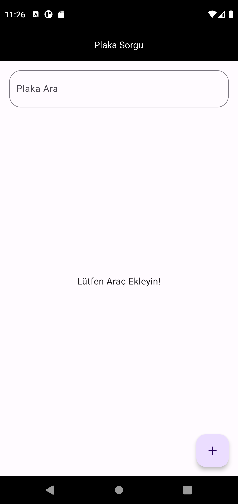
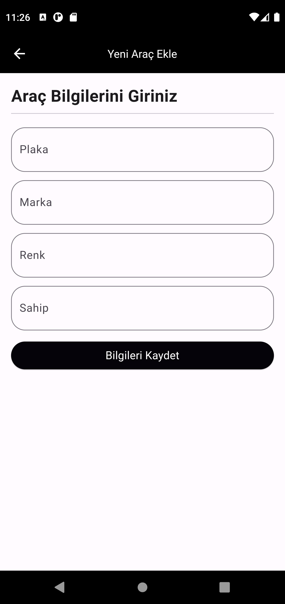
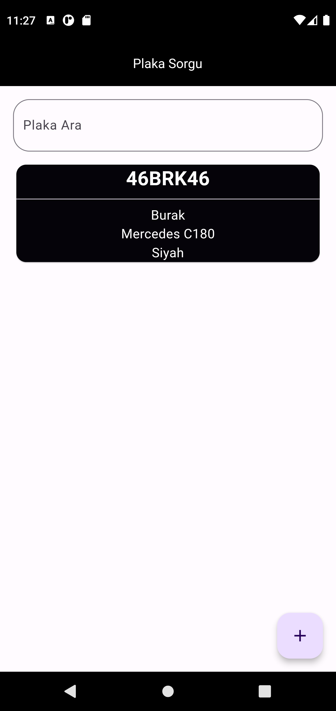
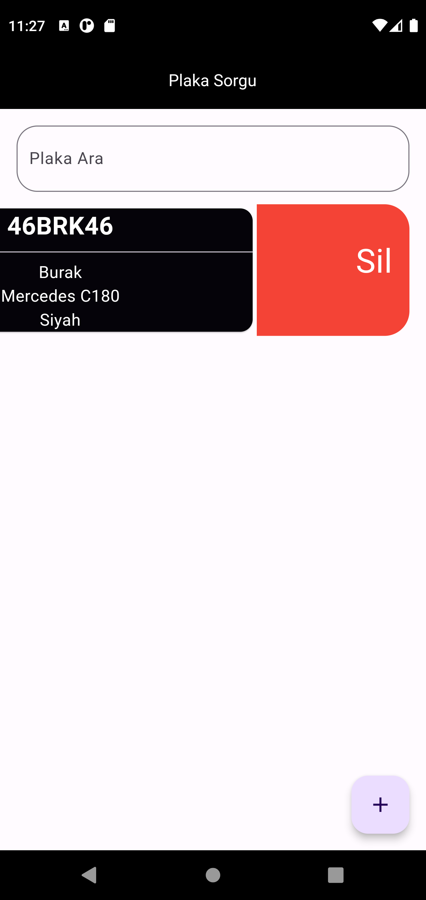
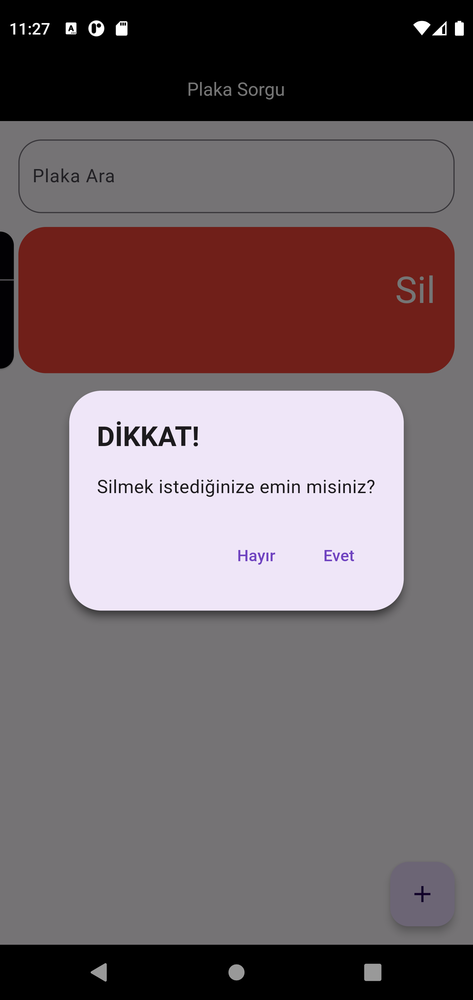
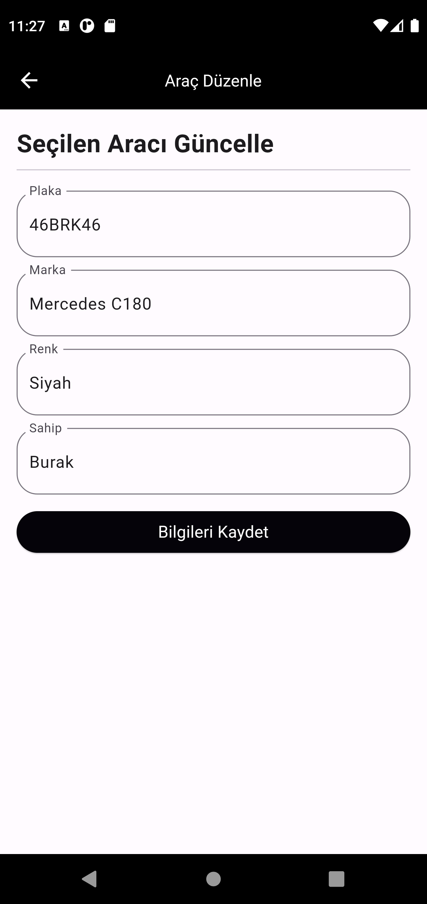
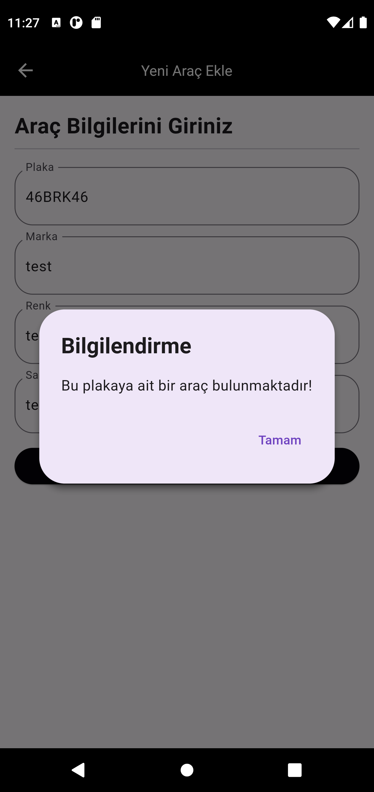

# Plaka Sorgu

Bu uygulama, bir güvenlik görevlisinin görev yerinde giren çıkan araçları kontrol etmesi için tasarlanmıştır.

## Özellikler

- **Araçları Listeleme:** Görev yerinde bulunan araçları listeleyebilirsiniz.
- **Araç Ekleme:** Yeni araçları sisteme ekleyebilirsiniz.
- **Araç Ekleme Kontrolü:** Eklenen aracın daha önce eklenip eklenmediğini kontrol edebilirsiniz.
- **Araç Güncelleme:** Mevcut araçları güncelleyebilirsiniz.
- **Araç Silme:** Sistemden araçları silebilirsiniz.
- **Araçları Filtreleme:** Araçları belirli kriterlere göre filtreleyebilirsiniz.

## Kullanım

1. Uygulamayı indirin.
2. Gerekli paketleri yükleyin: `flutter pub get`
3. Uygulamayı başlatın: `flutter run`

## Veritabanı

Uygulama, local bir veritabanı kullanmaktadır. Bu veritabanı sadece kullanıcı tarafından erişilebilir ve güncellenebilir.

## Ekran Görüntüleri

